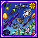

# Assorted Additions

Assorted Additions is a content mod for Terraria which adds all sorts of things like the name implies. Currently the mod adds around 200 new items, a new category of accessory called "Runes", 13 NPCs, 1 boss and a bunch of tweaks such as improved loot for underground biome chests (mushroon, granite etc.), alternative ways of obtaining some accessories and non-consumable summoning items.  

The mod does not have a proper wiki, however, an overview of the progression / class setups can be found [in this markdown file](ClassSetups.md). This GitHub page also contains information on the different items/things added (see section below).


## Navigating the github page

Currently I am using the issues as a sort of wiki. Each new "thing" added to the mod has its own issue which contains information about the "thing" added. 

Note that **only closed issues are things that have been added** so when looking up items you should filter issues by ```is:closed``` (or select closed) before searching for an item. Open issues are things that are being worked on or could be added in the future. 

Labels can be used to filter issues. The labels ```Melee```, ```Magic```, ```Ranged``` or ```Summon``` refer to weapons for that class. The ```bug``` label is for found bugs / bug reports and ```idea``` is for new additions that could be added.


## Contributing & Bug reporting

TODO

## License

The **source code** is licensed under The GNU General Public License v3.0. Note that some **non-code assets** are under different licenses as stated in [CREDITS.md](CREDITS.md). 
- Refer to [LICENSE](LICENSE) when dealing with the code in this repository.
- For non-code assets check [CREDITS.md](CREDITS.md).

## Credits
- Refer to [CREDITS.md](CREDITS.md)
